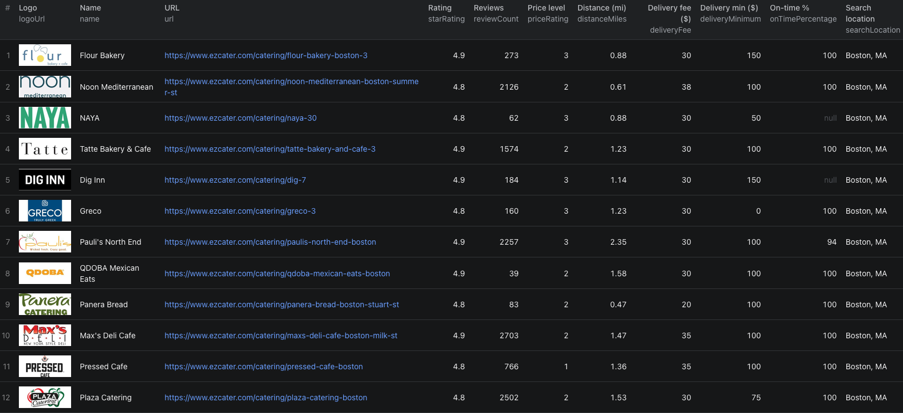

# How to Scrape ezCater Menus in Node.js

This example calls our [ezCater Listings Scraper](https://apify.com/piotrv1001/ezcater-listings-scraper) on Apify. It does not implement a scraper from scratch.



This is a larger Boston run; the code below requests three caterers with full menus.

## What this example does

- Searches for three delivery caterers serving Boston
- Requests full details and menus
- Waits for the Actor run to finish
- Fetches and prints the default dataset

## Prerequisites

- Node.js 18 or newer
- An Apify account and API token

## Installation

```bash
npm install
```

## Environment setup

Copy `.env.example` to `.env` and set `APIFY_TOKEN` to your token. Do not commit `.env`.

## Usage

```bash
npm start
```

## Code example

```js
import { ApifyClient } from 'apify-client';
import 'dotenv/config';

// Initialize the ApifyClient with your Apify API token
// Set APIFY_TOKEN in your .env file (copy .env.example to get started)
const client = new ApifyClient({
    token: process.env.APIFY_TOKEN,
});

// Prepare Actor input
const input = {
    locations: ['Boston, MA'],
    orderType: 'DELIVERY',
    scrapeMenus: true,
    maxItems: 3,
    proxyConfiguration: { useApifyProxy: false },
};

// Run the Actor and wait for it to finish
const run = await client.actor('piotrv1001/ezcater-listings-scraper').call(input);

// Fetch and print Actor results from the run's dataset (if any)
console.log('Results from dataset');
console.log(`💾 Check your data here: https://console.apify.com/storage/datasets/${run.defaultDatasetId}`);
const { items } = await client.dataset(run.defaultDatasetId).listItems();
items.forEach((item) => {
    console.dir(item);
});

// 📚 Want to learn more 📖? Go to → https://docs.apify.com/api/client/js/docs
```

## Example output

[`sample-output.json`](./sample-output.json) has abbreviated records from our September 24, 2026 three-caterer run. The live dataset also contains address, cuisine, reliability, and further menu fields. Compare `deliveryMinimum`, `deliveryFee`, and menu prices separately; the minimum is not a fee or a final checkout total.

## Use cases

- Shortlist caterers by city and delivery minimum
- Compare catering menus and prices
- Review dietary tags for a group order
- Track fees and ratings alongside source listings

## Try the Actor on Apify

**[Open the ezCater Listings Scraper on Apify](https://apify.com/piotrv1001/ezcater-listings-scraper)**

## Related resources

- [How to compare ezCater menus and delivery costs](https://www.falconscrape.com/blog/how-to-compare-ezcater-menus-and-delivery-costs)
- [Companion post hero artwork](./ezcater_blog.png)

## License

MIT
